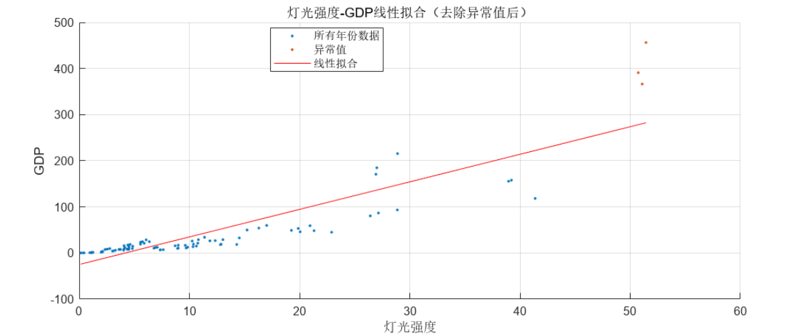
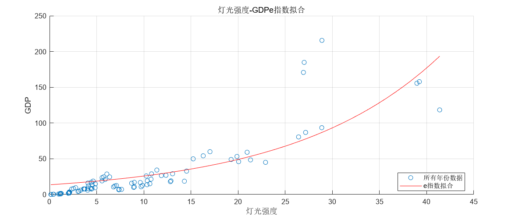
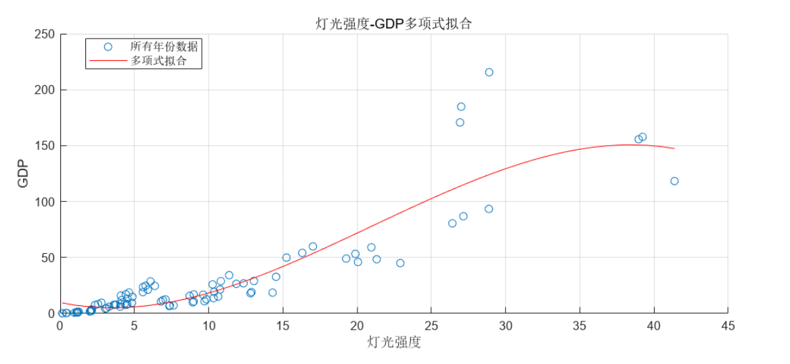
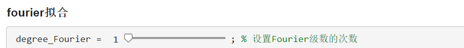
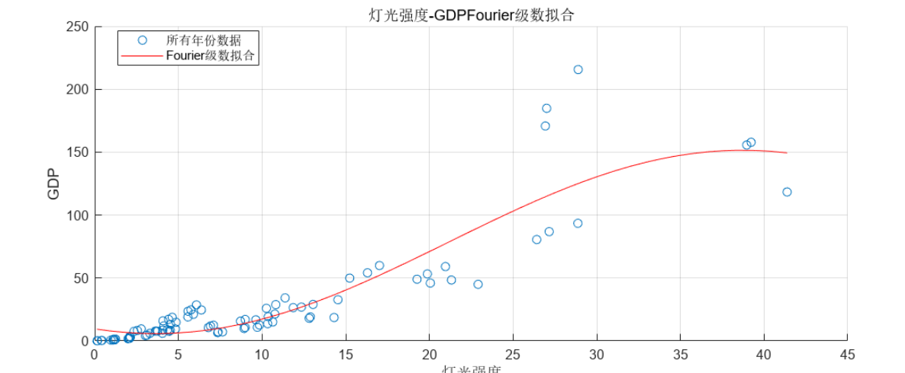
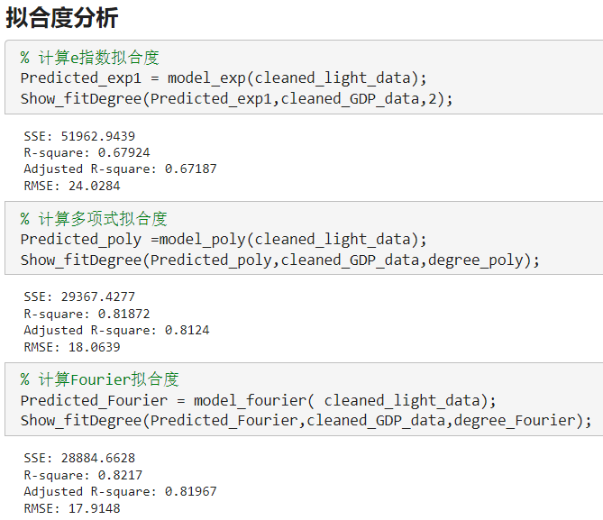
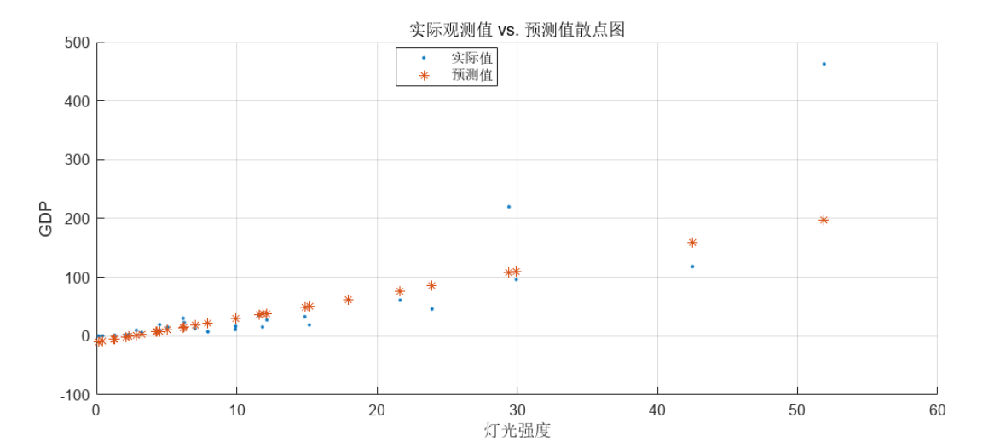

# 概述

针对各个省份2017、2018、2019年的平均灯光强度与平均GDP（元/平方米）数据，用来预测各个省份2020年的平均GDP数据。

# 处理步骤

## 异常值处理

## 模型构建

### e指数模型

### 多项式模型

利用滑块调节多项式次数：

### Fourier模型

利用滑块调节Fourier级数：

## 拟合度分析

在多项式（一次）时，完全符合示例结果，拟合度：Fourier（一级）>多项式（一次）>e指数。但在多项式次数在4次以上后，拟合度大于Fourier（一级）,但要注意过度拟合问题。

## 运用模型进行预测

# 评价

具体算法细节仍需调整，尤其是在灯光强度过高时的过拟合问题。

---

*@Time:2024/1/6* 
*@Author:TWH*

